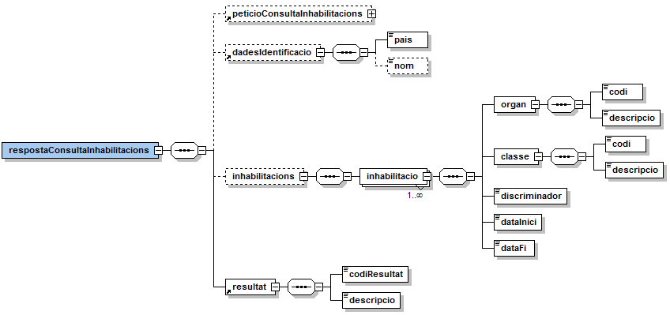
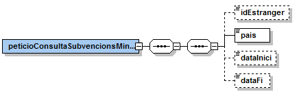
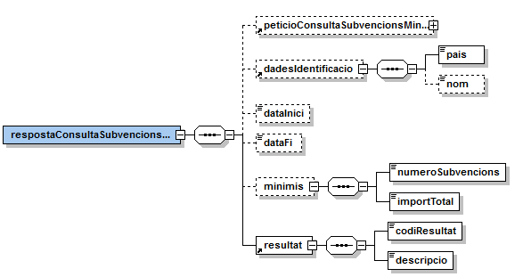
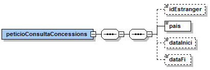
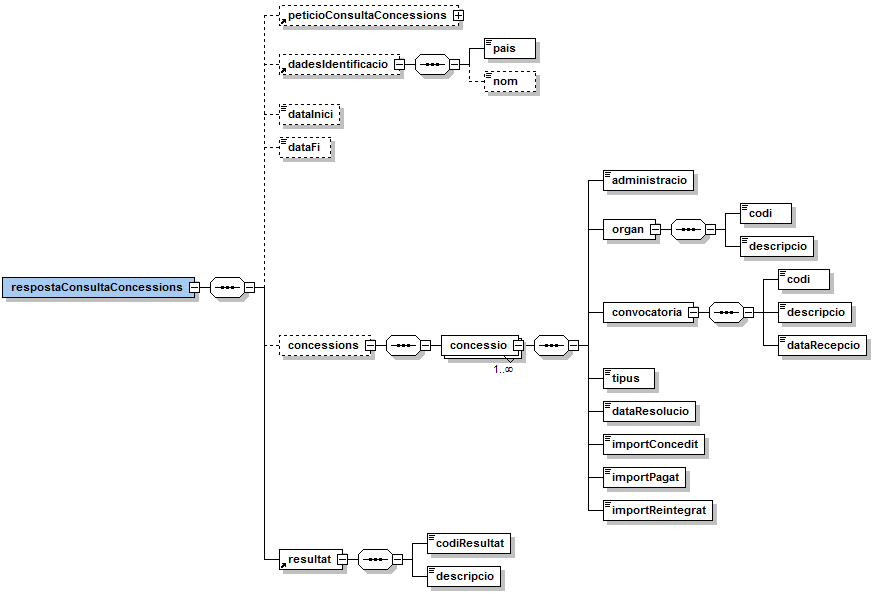

# VO - Intervención General de la Administración del Estado (IGAE)

## **Document d&#39;integració del servei** IGAE - Base de Dades Nacional de Subvencions

 
Realitzat per: Àrea de Tecnologia – Unitat de Projectes


**Històric de revisions**

| **Versió** | **Data** | **Autor** | **Comentaris** |
| --- | --- | --- | --- |
| V1.0 | 01/09/2021 | Roger Noguera i Arnau | Creació del document |


# 1 Introducció

Aquest document detalla la missatgeria associada al servei de consulta d&#39;informació de la Intervención General de la Administración del Estado.

Per poder realitzar la integració cal conèixer prèviament la següent documentació:

- [Document de Missatgeria Genèrica de la PCI del Consorci AOC.](https://github.com/ConsorciAOC/PCI/blob/main/Missatgeria/README.md)


# 2 Transmissions de dades disponibles

Les dades disponibles a través del servei són les que es presenten a continuació:

| **EMISSOR** |
| --- |
| Intervención General de la Administración del Estado via MINHAP |

| **PRODUCTE** | **MODALITAT** | **DESCRIPCIO** |
| --- | --- | --- |
| **IGAE** | IGAE\_INHABILITACIONS  | Consulta d&#39;inhabilitacions per a percebre subvencions o ajudes de la Base de Datos Nacional de Subvenciones (BDNS) |
|  **IGAE** | IGAE\_MINIMIS | Consulta de consulta de subvencions o ajudes per la regla MINIMIS de la Base de Datos Nacional de Subvenciones (BDNS). |
|  **IGAE** | IGAE\_CONCESSIONS | Consulta de concessions per a percebre subvencions o ajudes de la Base de Datos Nacional de Subvenciones (BDNS). |

Les modalitats disposen de versió imprimible del resultat de la consulta en format PDF. Per més detalls adreceu-vos a l&#39;apartat _Extensions de missatgeria_ del [document de missatgeria genèrica.](https://github.com/ConsorciAOC/PCI/blob/main/Missatgeria/README.md)

# 3 Missatgeria dels serveis

A continuació es detalla la missatgeria corresponent al bloc de dades específiques de les modalitats de consum del producte.

---

 L&#39;emissor de les dades requereix que s&#39;informin les dades del funcionari que realitza la consulta. Així, cal informar els següents camps de l&#39;element ___Funcionario___ del bloc de dades genèriques:

```
/Peticion/Funcionario/NombreCompletoFuncionario,
/Peticion/Funcionario/NifFuncionario,
//SolicitudTransmision/DatosGenericos/Solicitante/Funcionario/NombreCompletoFuncionario
//SolicitudTransmision/DatosGenericos/Solicitante/Funcionario/NifFuncionario 
```

## 3.1 Consulta d&#39;inhabilitacions (IGAE\_INHABILITACIONS)

El servei de consulta de dades de inhabilitacions permet consultar si hi ha una inhabilitació per percebre subvencions o ajudes del ciutadà objecte de la consulta, ja sigui per imposició de sentència judicial ferma o per sanció administrativa en els supòsits previstos en les lleis.

### 3.1.1 Petició – dades genèriques

| _Element_ | _Descripció_ |
| --- | --- |
| //DatosGenericos/Titular/TipoDocumentacion | Tipus de documentació (DNI, NIE, Pasaporte). Si la consulta es fa per un document estranger diferent al passaport, indiqueu DNI i idEstranger a les dades específiques. |
| //DatosGenericos/Titular/Documentacion | Documentació. |

### 3.1.2 Petició – dades específiques


| _Element_ | _Descripció_ |
| --- | --- |
| peticioConsultaInhabilitacions/idEstranger | Indica que el DNI informat correspon a un document identificador estranger diferent al passaport. |
| peticioConsultaInhabilitacions/pais | Codi del país al que correspon la documentació del titular (format ISO 3166-1 alfa-2). |
| peticioConsultaInhabilitacions/dataInici | Data d&#39;inici per limitar la cerca del període d&#39;inhabilitació (format *AAAA-MM-DD*). Si s&#39;informa aquest element, cal informar *dataFi*. |
| peticioConsultaInhabilitacions/dataFi | Data de fi per limitar la cerca del període d&#39;inhabilitació (format *AAAA-MM-DD*). |

### 3.1.3 Resposta – dades específiques



| _Element_ | _Descripció_ |
| --- | --- |
| respostaConsultaInhabilitacions/peticioConsultaInhabilitacions | Bloc de dades corresponent a la petició que origina la resposta. |
| /respostaConsultaInhabilitacions/dadesIdentificacio/pais | Codi de país de la documentació del titular consultat (format ISO 3166-1 alfa-2). |
| /respostaConsultaInhabilitacions/dadesIdentificacio/nom | Nom de la persona / entitat consultada. |
| //inhabilitacions/inhabilitacio | Bloc de dades corresponent a una inhabilitació. |
| //inhabilitació/organ/codi | Codi DIR3 de l&#39;òrgan propietari de la inhabilitació. |
| //inhabilitació/organ/descripcio | Descripció de l&#39;òrgan propietari de la inhabilitació. |
| //inhabilitació/classe/codi | Codi del tipus d&#39;inhabilitació. |
| //inhabilitació/classe/descripcio | Descripció del tipus d&#39;inhabilitació. |
| //inhabilitació/discriminador | Text identificador i descriptiu de la inhabilitació aportat per l&#39;òrgan gestor. |
| //inhabilitació/dataInici | Data d&#39;inici del període d&#39;inhabilitació. |
| //inhabilitació/dataFi | Data de fi del període d&#39;inhabilitació. |
| respostaConsultaInhabilitacions/resultat/codiResultat | Codi de resultat de la consulta:<li> 2000 - No existeix informació enregistrada a la BDNS per a la identificació aportada. <li> 2001 - No consta inhabilitació judicial o administrativa a data d&#39;avui.<li> 2002 - No consta inhabilitació judicial o administrativa vigent entre el rang de dates indicat.<li> 2003 - Informació d&#39;inhabilitacions trobada.<li> 2005, 2006 - Error en el rang de dates.<li>0502 - Error realitzant la consulta.|
| respostaConsultaInhabilitacions/resultat/descripcio | Descripció del resultat. |

## 3.2 Consulta de subvencions MINIMIS (IGAE\_MINIMIS)

El servei de consulta de dades de subvencions MINIMIS permet accedir a les subvencions que compleixen la regla MINIMIS del titular objecte de la consulta i obtenir la suma de tots els imports de les mateixes.

### 3.2.1 Petició – dades genèriques

| _Element_ | _Descripció_ |
| --- | --- |
| //DatosGenericos/Titular/TipoDocumentacion | Tipus de documentació (DNI, NIE, Pasaporte). Si la consulta es fa per un document estranger diferent al passaport, indiqueu DNI i idEstranger a les dades específiques. |
| //DatosGenericos/Titular/Documentacion | Documentació. |

### 3.2.2 Petició – dades específiques



| _Element_ | _Descripció_ |
| --- | --- |
| peticioConsultaSubvencionsMinimis/idEstranger | Indica que el DNI informat correspon a un document identificador estranger diferent al passaport. |
| peticioConsultaSubvencionsMinimis/pais | Codi del país al que correspon la documentació del titular (format ISO 3166-1 alfa-2). |
| peticioConsultaSubvencionsMinimis /dataInici | Data d&#39;inici per limitar la cerca de concessions de subvencions MINIMIS (format *AAAA-MM-DD*). Si s&#39;informa aquest element, cal informar dataFi. Si no s&#39;informa el sistema contempla tres anys des de la data actual. |
| peticioConsultaSubvencionsMinimis /dataFi | Data de fi per limitar la cerca de concessions de subvencions MINIMIS (format *AAAA-MM-DD*). |

### 3.2.3 Resposta – dades específiques



| _Element_ | _Descripció_ |
| --- | --- |
| respostaConsultaSubvencionsMinimis/peticioConsultaSubvencionsMinimis | Bloc de dades corresponent a la petició que origina la resposta. |
| /respostaConsultaSubvencionsMinimis/dadesIdentificacio/pais | Codi de país de la documentació del titular consultat (format ISO 3166-1 alfa-2). |
| /respostaConsultaSubvencionsMinimis/dadesIdentificacio/nom | Nom de la persona / entitat consultada. |
| /respostaConsultaSubvencionsMinimis/dataInici | Data d&#39;inici del rang de dates consultat. Si no s&#39;informa en la petició, el sistema contempla tres anys des de la data actual. |
| /respostaConsultaSubvencionsMinimis/dataFi | Data de fi del rang de dates consultat. |
| //minimis/numeroSubvencions | Número de subvencions trobades. |
| //minimis/importTotal | Suma dels imports concedits. |
| respostaConsultaInhabilitacions/resultat/codiResultat | Codi de resultat de la consulta: <li> 2000 - No existeix informació enregistrada a la BDNS per a la identificació aportada.<li> 2201 - No consten en la BDNS concessions de subvencions afectades per la regla de MINIMIS entre el rang de dates indicat.<li> 2202 – Concessions de subvencions trobades.<li> 2006, 2103, 2303 - Error en el rang de dates.<li> 0502 - Error realitzant la consulta. |
| respostaConsultaInhabilitacions/resultat/descripcio | Descripció del resultat. |

## 3.3 Consulta de concessions (IGAE\_CONCESSIONS)

El servei de consulta de concessions de subvencions i ajudes públiques permet obtenir informació de les concessions atorgades a un beneficiari en un període tot indicant l&#39;òrgan que la concedeix, convocatòria així com els imports concedits, pagats i, si escau, reintegrats.

### 3.3.1 Petició – dades genèriques

| _Element_ | _Descripció_ |
| --- | --- |
| //DatosGenericos/Titular/TipoDocumentacion | Tipus de documentació (DNI, NIE, Pasaporte). Si la consulta es fa per un document estranger diferent al passaport, indiqueu DNI i idEstranger a les dades específiques. |
| //DatosGenericos/Titular/Documentacion | Documentació. |

### 3.3.2 Petició – dades específiques



| _Element_ | _Descripció_ |
| --- | --- |
| peticioConsultaConcessions/idEstranger | Indica que el DNI informat correspon a un document identificador estranger diferent al passaport. |
| peticioConsultaConcessions/pais | Codi del país al que correspon la documentació del titular (format ISO 3166-1 alfa-2). |
| peticioConsultaConcessions/dataInici | Data d&#39;inici per limitar la cerca de concessions de subvencions i ajudes (format *AAAA-MM-DD*). Si s&#39;informa aquest element, cal informar dataFi. Si no s&#39;informa el sistema contempla cinc anys des de la data actual. |
| peticioConsultaConcessions/dataFi | Data de fi per limitar la cerca de concessions de subvencions i ajudes (format *AAAA-MM-DD*). |

### 3.3.3 Resposta – dades específiques

| _Element_ | _Descripció_ |
| --- | --- |
| respostaConsultaConcessions/peticioConsultaConcessions | Bloc de dades corresponent a la petició que origina la resposta. |
| /respostaConsultaInhabilitacions/dadesIdentificacio/pais | Codi de país de la documentació del titular consultat (format ISO 3166-1 alfa-2). |
| /respostaConsultaInhabilitacions/dadesIdentificacio/nom | Nom de la persona / entitat consultada. |
| /respostaConsultaInhabilitacions/dataInici | Data d&#39;inici del rang de dates consultat. Si no s&#39;informa en la petició, el sistema contempla cinc anys des de la data actual. |
| /respostaConsultaInhabilitacions/dataFi | Data de fi del rang de dates consultat. |
| //concessions/concessio | Bloc de dades corresponent a una concessió. |
| //concessio/administracio | Administració a la que pertany l&#39;òrgan cedent. |
| //concessio/organ/codi | Codi DIR3 de l&#39;òrgan gestor que realitza la concessió. |
| //concessio/organ/descripcio | Descripció de l&#39;òrgan gestor que realitza la concessió. |
| //concessio/convocatoria/codi | Codi identificador de la convocatòria anual assignat per la IGAE. |
| //concessio/convocatoria/descripcio | Descripció de la convocatòria. |
| //concessio/convocatoria/dataRecepcio | Data de recepció de la convocatòria (*AAAA-MM-DD*). |
| //concessio/tipus | Tipus de concessió. |
| //concessio/dataResolucio | Data de la resolució de la concessió (*AAAA-MM-DD*). |
| //concessio/importConcedit | Import concedit (euros). |
| //concessio/importPagat | Import pagat (euros). |
| //concessio/importReintegrat | Import reintegrat (euros). |
| respostaConsultaConcessions/resultat/codiResultat | Codi de resultat de la consulta:<li>2000 - No existeix informació enregistrada a la BDNS per a la identificació aportada.<li> 2101 - No consta ninguna concessió.<li> 2102 - Informació de concessions trobada.<li> 2006, 2103, 2104 - Error en el rang de dates.<li>0502 - Error realitzant la consulta. |
| respostaConsultaConcessions/resultat/descripcio | Descripció del resultat. |


